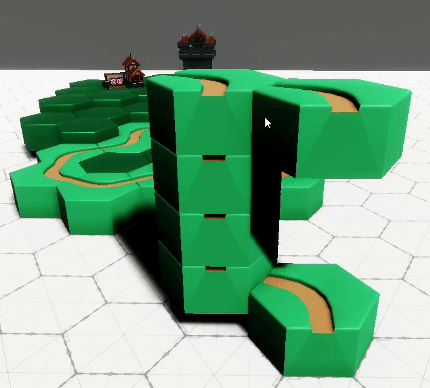
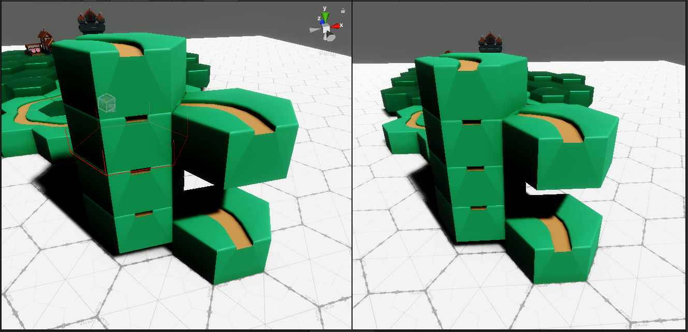
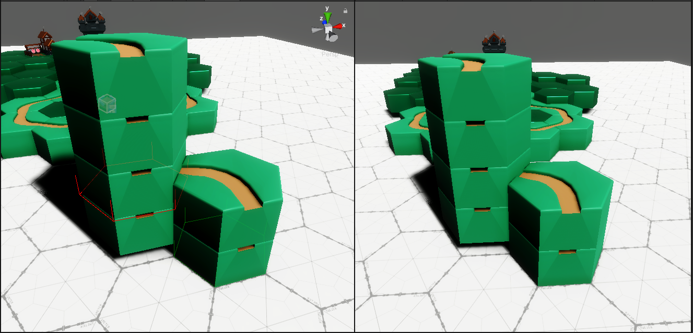
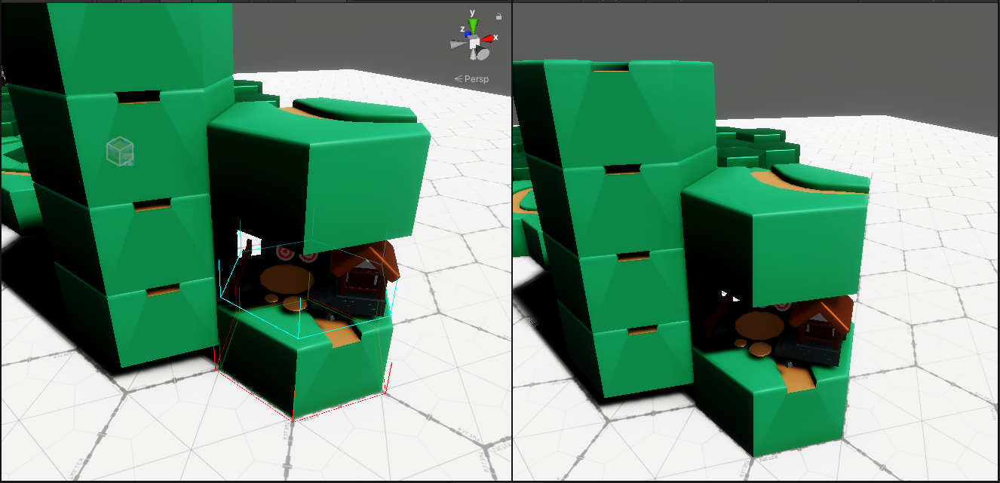
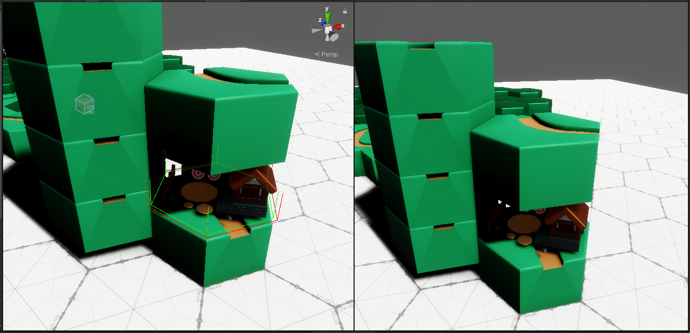
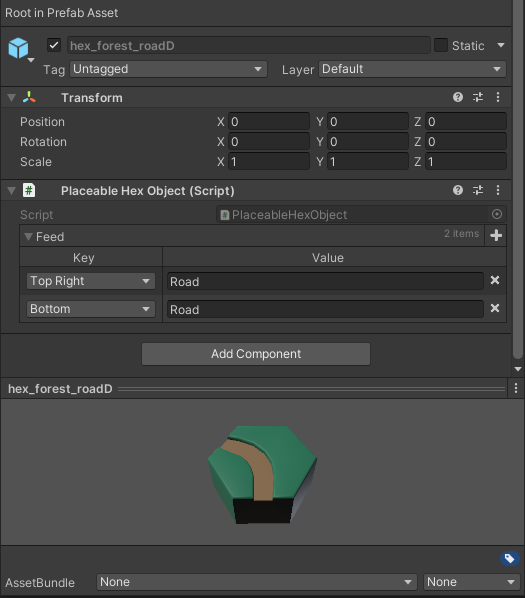
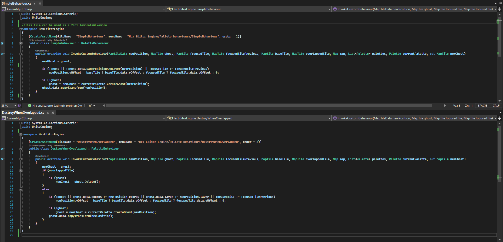
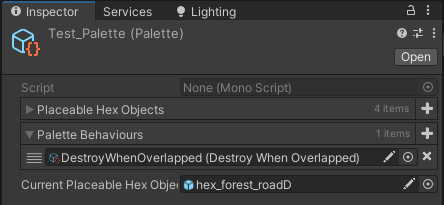

# Ultimate Hexagonal World Editor

Requirements:
- [Odin Inspector](https://assetstore.unity.com/packages/tools/utilities/odin-inspector-and-serializer-89041 "Unity's Asset Store page")

Third party assets:
- [KayKit Medieval Builder Pack 1.0](https://kaylousberg.itch.io/kaykit-medieval-builder-pack)
---

This is not regular hexagonal world editor. What makes it so special is the awareness of the surroundings and ability to change behaviour with something as simple as a plugin. It was built to handle every aspect of hexagonal maps that a single developer can ever require. During creation I kept in mind the needs of creating the hexagonal versions of different games, starting with Minecraft and ending with Factorio. To have good experience, I managed to use Dictionary<Enum,String> that has to be saved as asset, and that's why there is the Odin reuirement.

---
## Environmental awarness
Awarness of the surrounding is achieved by getting information about neighbours
There are five sources of informations about the surrounding:
- What is mouse hovering over (focussedTile - red)
- What is the cell that ghost should be on (overlappedTile - blue)
- What is the cell beneath the ghost (baseTile - green)
- What is the information comming from the neighbours
- And the map itself

This awarness can be used for example to not allow to build on lava, or to rotate ghost to match the seaside, or, as shown below, to snap to other layers

Explanation for the 3 special tiles (Left side - Editor, Right side - Game) :

When mouse is on the third tile above the floor, the one that i have mouse over has red outline

When mouse is on the second tile above the floor, and the tile on the first layer exists, and has smaller vertical offset, green is the one that is the base of the ghost

When there is a building in the way and mouse is on the bottom tile

When there is a building in the way and mouse is on the building

---
The information from the neighbours is extracted by map, that takes into account both the tile type and it's rotation.
The received information is like a radio signal, where every tile is a radio station and they emit strings in all directions. This information I call Feed, as it is given as a FeedBack

Example of configuration for a certain hexagonal tile

## Writing plugins
The most important part in this editor, that it makes it outstand the competition is ablity to write plugins
Here is an template, which is just a default behavior, and a second behaviour that makes the ghost disappear when it turns out that it overlaps something

PaletteBehaviour is a class that derivates from ScriptableObject, so an instance of it can be saved as a file. After writing a plugin, we make a file from it, and we drag-and-drop it to the list of custom behaviours located in the other file - the palette file.

